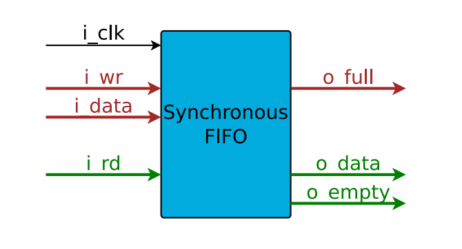

# FIFO
rtl implementation of fifo

# Summary — *Getting the Basic FIFO Right* (ZipCPU)

- Ok so it has many application few of them which can be read from https://zipcpu.com/blog/2017/07/29/fifo.html
**Important note from the author:**
The author later found bugs in this FIFO design using formal verification. This version is mainly educational; it may mishandle **overflow** and **underflow** cases. The newer tutorial version is recommended.

## 1. What a FIFO is

FIFO = **First In, First Out**.

Think of it as a queue:

* Data enters at one end (**write**)
* Data leaves in the same order (**read**)

FIFO is used whenever:

> **Producer speed ≠ Consumer speed**

Examples:

* CPU buffering interrupts
* SDRAM burst transactions
* UART transmit/receive buffers
* Audio streaming
* Video pipelines

Purpose:

* Absorb timing differences
* Prevent stalls
* Reduce CPU overhead

---

# 2. FIFO operations

A basic FIFO supports:

### Reset

Clear contents and reset state.

### Write (enqueue)

Add data to the tail.

Constraint:

* If buffer is full → **overflow**

### Read (dequeue)

Remove oldest data.

Constraint:

* If buffer is empty → **underflow**

Status signals:

* Current fill level
* Empty
* Full
* Overflow flag
* Underflow flag

---

# 3. Block diagram

- when i_wr is high we write i_data to fifo.
- when i_rd is high we return o_data from fifo
- On any i_wr && !o_full, we’ll write i_data to memory
˝ On any i_rd && !o_empty, we’ll read and return o_data from memory
- On any w_wr, we’ll write i_data to our internal memory
- On any w_rd, we’ll read and return o_rdata from memory